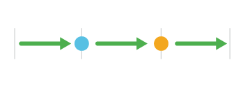
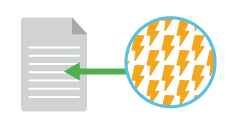

---
cover:
description: ポストモーテム文書を作成するための具体的なステップを紹介します。ポストモーテムに含めるべき最も重要な情報、その情報の収集と提示方法、そしてシステム改善につながる効果的な分析の実施方法を学びます。
---

以下は、概要レベルでのポストモーテム実施のステップです。各ステップの実施方法の詳細を以下に示します。

1. インシデントの新しいポストモーテムを作成する。
1. 「インシデントポストモーテムミーティング」共有カレンダーに、必須および任意の参加者のために、必要な時間枠内でポストモーテムミーティングをスケジュールする。
1. ステータス/影響の重要な変化と、対応者が取った主要なアクションをインシデントタイムラインに記入する。
    - タイムラインの各項目について、データの出所となるメトリクスまたはサードパーティのページを含める。
1. インシデントを分析する。
    - 表面的な原因と根本的な原因を特定する。
    - 技術とプロセスの両方を考慮する。
1. フォローアップアクションのチケットを作成する。
1. 外部向けメッセージを作成する。
1. レビューを依頼する。
1. ポストモーテムミーティングに参加する。
1. ポストモーテムを共有する。

## オーナーの責任
重大なインシデント対応の終了時、またはその直後に、[インシデントコマンダー](https://response.pagerduty.co.jp/training/incident_commander/)は対応者の一人をポストモーテムのオーナーとして選出します。選出されたオーナーはインシデントコマンダーから直接通知を受けます。ポストモーテムの作成は最終的には共同作業となりますが、単一のオーナーを選出することで確実に完了させることができます。

ポストモーテムのオーナーは以下の責任を負います：

- 共有カレンダーにポストモーテムミーティングをスケジュールし、関連する人々を招待する（Sev-1の場合は3日以内、Sev-2の場合は5営業日以内にスケジュールする必要があります）。
- インシデントを調査し、調査に必要な他のチームのメンバーを招集する。
- ページに必要なすべてのコンテンツが更新されていることを確認する。含めるべき内容については[テンプレート](../resources/post_mortem_template.md)を参照してください。
- フォローアップチケットを作成する（オーナーはチケットの作成のみ責任を負い、解決までのフォローアップは責任外です）。
- 会議前に適切な関係者とポストモーテムの内容をレビューし、ポストモーテムミーティングでトピックを進行する（インシデントコマンダーが会議を「運営」し、議論を軌道に乗せますが、あなたが最も多く話すことになるでしょう）。
- ポストモーテムの結果を社内に伝える。

ポストモーテムのオーナーはポストモーテム文書を作成し、関連するすべての情報を更新します。

## 管理

1. 文書を作成する。
2. すべての対応者を追加する。
3. 会議をスケジュールする。

まだインシデントコマンダーが実施していない場合、ポストモーテムオーナーの最初のステップは、インシデントのための新しい空のポストモーテムを作成することです。Slackの履歴を確認して対応者を特定し、彼らにポストモーテムの作成を手伝ってもらえるようにページに追加します。インシデントコマンダーと書記官も足しましょう。インシデント対応のレコーディングへのリンクを追加します。

次に、インシデントの複雑さに応じて30分から1時間のポストモーテムミーティングをスケジュールします。プロセスの最初に会議をスケジュールすることで、SLA内にポストモーテムが完了することを確保します。**会議はSev-1の場合は3暦日以内、Sev-2の場合は5営業日以内にスケジュールする必要があります。**すべての参加者にとって最適な時間を見つけることを心配する必要はありません。優先事項はこの時間枠内にスケジュールすることであり、参加者はそれに応じてスケジュールを調整する必要があります。PagerDutyでは、すべてのポストモーテムミーティングを「インシデントポストモーテムミーティング」共有カレンダーにスケジュールし、組織全体で関心のある人々が簡単に見つけられるようにしています。

ポストモーテムミーティングには以下の人々を招待します：

- 必須
    - [インシデントコマンダー](https://response.pagerduty.co.jp/training/incident_commander/)。
    - インシデントコマンダーをシャドーイングしていた担当者（いた場合）。
    - インシデントに関与した[サービスオーナー](https://response.pagerduty.co.jp/training/subject_matter_expert/)。
    - インシデントに関与した主要なエンジニア/対応者。
    - 影響を受けたシステムのエンジニアリングマネージャー。
    - 影響を受けたシステムのプロダクトマネージャー。
- 任意
    - [カスタマーリエゾン](https://response.pagerduty.co.jp/training/customer_liaison/)（Sev-1インシデントの場合のみ）。

PagerDutyのポストモーテムには、ポストモーテムが現在プロセスのどの段階にあるかを示す「ステータス」フィールドがあります。以下は、値の説明と使用方法です。

| ステータス | 説明 |
|-|-|
| **ドラフト** | ポストモーテムの内容がまだ作業中であることを示します。 |
| **レビュー中** | ポストモーテムの内容が完成し、ポストモーテムミーティングでのレビューの準備ができていることを示します。 |
| **レビュー済み** | 会議が終了し、内容がレビューされ合意されたことを示します。 「対外メッセージ」がある場合、カスタマーサポートチームがメッセージを取り、適切にステータスページを更新します。 |
| **クローズ** | ポストモーテムに関するさらなるアクションは必要ない状態です（未解決の問題はJIRAで追跡されます）。 「対外メッセージ」がない場合、会議終了後にこのステータスに直接移行できます。 「対外メッセージ」がある場合、サポートチームがメッセージを投稿した後にこのステータスに更新します。 |

## タイムラインの作成

まずタイムラインに焦点を当てます。インシデント中に起きた事実を文書化します。何をすべきだったか、何をすべきでなかったか、インシデントの原因は何かといった評価は避けてください。ここで事実のみを提示することで、非難を避け、より深い分析をしやすくします。またインシデントは、対応者が気づいて対応を開始する前に始まっていた可能性があることに注意してください。タイムラインにはステータス/影響の重要な変化と対応者が取った主要なアクションを含めます。後知恵バイアスを避けるため、タイムラインはインシデント発生前の時点から始め、解決から逆算するのではなく、時系列に沿って進めてください。

Slackのインシデントログを確認して、対応中に行われた重要な決定やアクションを見つけます。後から考えると知っておきたかったけれども、インシデント中には知らなかった情報も含めましょう。このような追加情報は、影響を受けたサービスに関連するモニタリング、ログ、デプロイを確認すると見つけることができます。モニタリングについては分析の段階で精査しますが、まずはインシデントに関連する重要なイベントをタイムラインに追加し、インシデントのステータスと影響の変化も含めてください。

タイムラインの各項目について、データの出所となるメトリクスまたはサードパーティのページを特定します。これにより各ポイントが明確に説明され、意見ではなく事実に基づいていることが保証されます。これはモニタリンググラフへのリンク、ログ検索、Xのポスト、その他タイムラインで説明しようとしているデータポイントを示すものであれば何でも構いません。

!!! info "重要なポイント"
    * 事実に忠実であること。
    * インシデントのステータスと影響の変化を含めること。
    * 対応者が行った重要な決定とアクションを含めること。
    * 各ポイントをメトリクスで説明すること。

## 影響の文書化

影響はいくつかの観点から説明する必要があります：

- 影響が発生していた期間はどれくらいですか？言い換えれば、ユーザー/顧客が影響を受けた時間の長さはどれくらいですか？
    - 影響の長さは対応作業の長さとは異なる場合があることに注意してください。影響は、問題が検出されてインシデント対応が開始される前にすでに始まっていた可能性があります。
- 何人の顧客が影響を受けましたか？
    - サポートは、影響を受けたすべての顧客のリストを必要とする場合があり、個別に連絡を取ることがあります。
- 何人の顧客がインシデントについてサポートに連絡しましたか？
- どの機能がどの程度影響を受けましたか？
    - 製品に特化したビジネスメトリクスで影響を定量化します。PagerDutyの場合、これにはイベント送信、処理の遅延、通知配信の遅延などが含まれます。

## インシデントの分析

インシデント中に何が起きたかを理解したら、さらに時間をさかのぼってインシデントにつながった要因を探します。テクノロジーは、継続的に変化する関係のネットワーク（組織的、人的、技術的）を伴う複雑なシステムです。

リチャード・クック博士の論文「[How Complex Systems Fail](http://web.mit.edu/2.75/resources/random/How%20Complex%20Systems%20Fail.pdf)」によれば、複雑なシステムは障害から強く防御されている一方、一見無害な問題が独自に組み合わさった結果、壊滅的な障害を引き起こします。さらに、明白な障害には複数の欠陥が必要なため、「根本原因」を特定することは根本的に間違っています。**複雑なシステムの大きな障害には単一の根本原因はなく、障害が可能になる環境を作り出す複数の要因の組み合わせがあります。**ポストモーテムオーナーのインシデント分析の目標は根本原因を特定することではなく、この障害を引き起こした可能性のある複数の要因を理解することです。

クックはまた、「根本原因」を見つける努力はシステムの理解を反映するものではなく、むしろ発生した出来事に対して特定の局所的な力を非難する文化的な必要性を反映していると述べています。非難がないことは効果的なポストモーテムにとって不可欠です。**個人の行動が根本原因と見なされるべきでは決してありません。**効果的な分析では、人間の行動よりも深いところまで掘り下げを行います。誰かのミスが障害に寄与した場合、分析においては個人への非難を避けるためにこれを匿名化する意味があります。どのチームメンバーも同じミスを犯す可能性があると仮定しましょう。クックによれば、「あらゆる実務担当者の行動は実のところギャンブルであり、不確実な結果に直面しながら行われる行為です。」

ポストモーテムオーナーは、影響を受けたサービスのモニタリングを調査することから分析を始めるべきです。インシデントが始まった時点とその前に、突然のスパイクやフラットラインがなかったか異常を探します。データがどのように収集されたかを他の人が確認できるように、データを検索するために使用したコマンドやクエリ、グラフ画像、モニタリングツールからのリンクをこの分析と一緒にまとめてください。このサービスや動作に対するモニタリングがない場合は、モニタリングの構築をこのポストモーテムのアクションアイテムとしてしましょう。以下の[アクションアイテムの作成](#followup)で詳しく説明します。

!!! warning "モニタリングの重要性"
    Puppetの2018年DevOpsレポートは、サービスを運用するチームがモニタリングを設定できるようにすることが、成功するDevOpsの基本的な実践であることを強調しています。チームが自分たちのパフォーマンス測定を定義、管理、共有できるようにすることは、継続的改善の文化に貢献します。

インシデントの原因を特定するもう一つの有効な戦略は、本番以外の環境でインシデントを再現することです。現象の切り分けを行えるように変数を変更して実験を行います。入力の一部を変更または削除した場合も、まだインシデントは発生しますか？

このレベルまで分析を行うと、インシデントの表面的な原因が明らかになります。次に、このような事象が発生しうる形でシステムが設計された背景を尋ねます。なぜ、当時それらの設計判断が最良の決定だと思われたのでしょうか？これらの質問に答えていくと、根本原因を明らかにするのにつながります。

以下は、ポストモーテムオーナーが特定の問題の種類を特定するのに役立つ質問です：

- これは単独のインシデントですか、それとも直近よく発生しているものの一部ですか？
- これは特定のバグや予想された種類の障害だったか、またアーキテクチャ的に予想していなかった問題の種類を明らかにしましたか？
- 過去にチームがやらないことを選択した作業で、このインシデントに寄与したものはありましたか？
- 過去に類似または関連するインシデントがあったかどうかを調査します。このインシデントは、システムのより大きな範囲の傾向を示すものですか？
- サービスの使用を継続的に成長させ拡大するにつれて、この種の問題は悪化/より発生しやすくなりますか？

!!! tip
    PagerDutyでは、技術的および組織的な計画に情報を提供するために、複数のインシデントに渡るより大きな範囲の傾向を分析するための別のプロセスがあります。詳細は[運用レビュー](http://reviews.pagerduty.com)に関するガイドをご覧ください。

根本原因ではないかもしれませんが、分析においてはプロセスも考慮してください。人々が協力し、コミュニケーションを取り、作業をレビューする方法がインシデントに寄与しましたか？これはまた、インシデント対応プロセスを評価し改善する機会でもあります。インシデント中の対応プロセスで何がうまくいき、何がうまくいかなかったかを考えてみてください。

ポストモーテムに調査結果の要約を書きます。チームは会議での議論を通じてさらなる学びを見つけ、追加の原因を特定するかもしれませんが、オーナーは生産的な議論を確保するために可能な限り事前作業と文書化を行ういましょう。

### 質問項目
以下は、深い分析を促進するためのリストです。非難を避け、学習を促進するために、「誰が」や「なぜ」ではなく、「どのように」「何が」という質問をしてください。

<table>
    <tr>
        <td>手がかり</td>
        <td>
            <ul>
                <li>何に注目していましたか？</li>
                <li>何が見落とされていましたか？</li>
                <li>予想と異なっていたのは何でしたか？</li>
            </ul>
        </td>
    </tr>
    <tr>
        <td>過去の知識/経験</td>
        <td>
            <ul>
                <li>これは予想された問題の種類でしたか、それともアーキテクチャ上予想されていなかった問題の種類を明らかにしましたか？</li>
                <li>参加者は事態の進展についてどのような想定を持っていましたか？</li>
                <li>過去に類似したインシデントはありましたか？</li>
            </ul>
        </td>
    </tr>
    <tr>
        <td>目標</td>
        <td>
            <ul>
                <li>当時のあなたの行動を支配していた目標は何でしたか？</li>
                <li>時間的制約やその他の制限が選択にどのような影響を与えましたか？</li>
                <li>過去にチームが行わないことを選択した作業で、このインシデントを防止または軽減できたものはありましたか？</li>
            </ul>
        </td>
    </tr>
    <tr>
        <td>評価</td>
        <td>
            <ul>
                <li>どのようなミス（例えば、解釈における）が起こりやすかったですか？</li>
                <li>インシデント発生前に、関連するサービスの健全性をどのように見ていましたか？</li>
                <li>このインシデントは、このサービスの健全性に関する見方を変えるべき何かを教えてくれましたか？</li>
            </ul>
        </td>
    </tr>
    <tr>
        <td>行動</td>
        <td>
            <ul>
                <li>どのように事態の流れに影響を与えられると判断しましたか？</li>
                <li>事態の流れに影響を与えるためにどのような選択肢が取られましたか？これらが当時の最善の選択肢であると、どのように判断しましたか？</li>
                <li>他の影響（運用上または組織上）が、状況の解釈や行動の決定にどのように役立ちましたか？</li>
            </ul>
        </td>
    </tr>
    <tr>
        <td>支援</td>
        <td>
            <ul>
                <li>誰かに助けを求めましたか？</li>
                <li>どのような契機で他の人へサポートを求めましたか？</li>
                <li>連絡する必要のある人々に連絡することはできましたか？</li>
            </ul>
        </td>
    </tr>
    <tr>
        <td>プロセス</td>
        <td>
            <ul>
                <li>人々が協力し、コミュニケーションを取り、作業をレビューする方法がインシデントに寄与しましたか？</li>
                <li>インシデント対応プロセスで上手くいったことと上手くいかなかったことは何ですか？</li>
            </ul>
        </td>
    </tr>
</table>

!!! info "重要なポイント"
    * 根本原因ではなく、寄与要因を見つけること。
    * 人間ではなく、システムに焦点を当てること。
    * モニタリングの異常を探すこと。
    * 本番以外の環境で再現し実験すること。
    * プロセスのレビューを忘れないこと。

## フォローアップアクション

インシデントの原因を特定した後、これが再び起こらないようにするために何をする必要があるかを考えます。分析に基づいて、この特定のインシデントではなく、この種の問題の発生を減らすための提案もあるかもしれません。

同じインシデントや類似のインシデントが再び発生する可能性を完全に排除することは不可能（または努力に値しない）かもしれないので、将来のインシデントの検出と軽減をどのように改善できるかも考慮してください。この種の問題に対してはより良いモニタリングとアラートが必要で、将来より迅速にチームが対応できるようにする必要がありますか？この種のインシデントが再び発生した場合、チームはどのように重大度や対応時間を抑えることができますか？インシデント対応プロセスを改善するためのアクションも特定することを忘れないでください。Slackのインシデント履歴を確認して、インシデント中に提起されたすべてのToDoアイテムを見つけ、これらもチケットとして文書化されていることを確認してください。（この段階では、チケットを作成するだけです。ポストモーテムミーティングの前にタスクを完了させる必要はありません。）

提案されたすべてのフォローアップアクションのチケットをタスク管理ツールで作成します。すべてのチケットに重大度レベルと日付タグを付けて、チケットシステムで簡単に見つけて報告できるようにします。チームのプロダクトオーナーが他の作業と比較してタスクの優先順位を付けるのに十分な情報があり、最終的な担当者がタスクを完了するのに十分な情報を得られるよう、チケットにできるだけ多くのコンテキストと提案された方向性を提供してください。

_;login:_ マガジンの記事「[Postmortem Action Items: Plan the Work and Work the Plan](https://www.usenix.org/system/files/login/articles/login_spring17_09_lunney.pdf)」で、John Lunney・Sue Lueder・Betsy Beyerは、Googleがポストモーテムのアクションアイテムを迅速かつ簡単に完了させるためにどのように書いているかを説明しています。彼らはすべてのアクションアイテムを実行可能、具体的、かつ範囲が限定されたものとして書くことを勧めています。

- **実行可能：** 各アクションアイテムを動詞で始まる文として表現します。アクションは有用な結果をもたらすようにします。
- **具体的：** 各アクションアイテムの範囲をできるだけ狭く定義し、範囲内と範囲外を明確にします。
- **範囲が限定的：** 各アクションアイテムを、オープンエンドまたは継続的なタスクではなく、いつ終了したかを示すように表現します。

| 不適切な表現 | より良い表現 |
|-|-|
| このシナリオのモニタリングを調査する。 | **実行可能：** このサービスが>1%のエラーを返すすべてのケースのアラートを追加する。 |
| 停止を引き起こした問題を修正する。 | **具体的：** ユーザーアドレスフォーム入力の無効な郵便番号を安全に処理する。 |
| エンジニアが更新前にデータベーススキーマが解析できることを確認するようにする。 | **範囲が限定的：** スキーマ変更の自動事前送信チェックを追加する。 |

<small>出典: _;login:_  Spring 2017 Vol. 42, No. 1.</small>

チケットを作成する前に議論が必要なフォローアップアクションの提案がある場合は、これらの項目をポストモーテムミーティングの議題に追加するメモを作成しましょう。場合によってはチームの検証や明確化が必要な提案かもしれません。会議でこれらの項目を議論すると、どのように進めるのが最善かを決定するのに役立つでしょう。

あまりにも多くのチケットを作成しないように注意してください。P0/P1のタスク、つまり絶対に対処すべきタスクのみを作成しましょう。ここにはいくらかトレードオフが発生することがありますが、それは問題ありません。ときには、インシデントの再発を減らす可能性のあるアクションを実行するために必要な労力に対して、ROIが見合わないケースもあります。その場合も、その決定をポストモーテムに文書化しておく価値があります。チームがアクションを実行しないことを選択した理由を理解するのは、やったことが役に立たなかったのではないかという無力感を避けるのにも役立つでしょう。

チケットを作成する人自身がそれを完了する責任を負うわけではないことに注意しましょう。チケットは影響を受けたサービスを所有するチームのプロジェクトでオープンされます。フォローアップアクションの責任を負うすべてのチームの代表者を少なくとも1人、ポストモーテムミーティングに招待します。

!!! info "重要なポイント"
    * このインシデントや類似のインシデントが再発する可能性を減らすために、何をする必要がありますか？
    * この種のインシデントをより早く検出するにはどうすればよいですか？
    * この種のインシデントの重大度や対応期間をどのように抑えることができますか？
    * 実行可能、具体的、かつ範囲が限定されたタスクを書くこと。

## 対外メッセージの作成

対外メッセージの目的は、技術や組織に関する独自情報を明かすことなく、何が起こったのか、それに対して何をしているのかについて顧客に十分な情報を提供することで信頼を築くことです。内部分析の一部は主に内部の読者に利益をもたらすもので、外部のポストモーテムに含める必要はありません。

外部ポストモーテムは、内部ポストモーテムに使用される情報を要約し、整理したものです。外部ポストモーテムには以下の3つのセクションが含まれます：

1. **要約：** インシデントの期間と観測可能な顧客への影響を要約した2〜3文。
1. **何が起きたか：** 
    - 原因の要約。
    - インシデント中の顧客向け影響の要約。
    - インシデント中の緩和努力の要約。
1. **これに対して何をしているか：** アクションアイテムの要約。

>ヒント：本当に完全な停止でない限り、「停止（outage）」という言葉を使用することは避けてください。代わりに「インシデント」または「サービス低下」という言葉を使用してください。顧客は一般的に「停止」を見て最悪の事態を想定します。

この時点で、外部ポストモーテムはまだ送信または公開すべきではないドラフトであることに注意してください。送信前にポストモーテムミーティングでレビューする必要があります。

## ポストモーテムレビュー

PagerDutyでは、スタイルと内容に関するポストモーテムのレビューに活用できる経験豊富なポストモーテム作成者のコミュニティがあります。これにより、会議中の無駄な時間を減らせます。会議がスケジュールされる少なくとも24時間前に、Slackへポストモーテムへのリンクを投稿してフィードバックを受け取ります。

以下は、私たちが主に確認する事柄です：

- 十分な詳細を提供していますか？
- 何が間違っていたかを指摘するだけでなく、問題の根本的な原因を掘り下げていますか？
- 「何が起きたか？」と「どう修正するか」を分けていますか？
- 提案されたアクションアイテムは意味がありますか？十分に範囲が限定されていますか？
- ポストモーテムは適切に書かれ、理解可能ですか？
- 対外メッセージは顧客の共感を得られそうな内容ですか、それとも反感を引き起こす可能性がありますか？

ポストモーテムのレビューは誤字脱字を細かく指摘することではありません（ただし、対外メッセージにスペルや文法エラーがないことを確認してください）。重要なのは、ポストモーテムから最大の利益を得るために、ポストモーテムに価値ある変更を加えるための建設的なフィードバックを提供することです。
