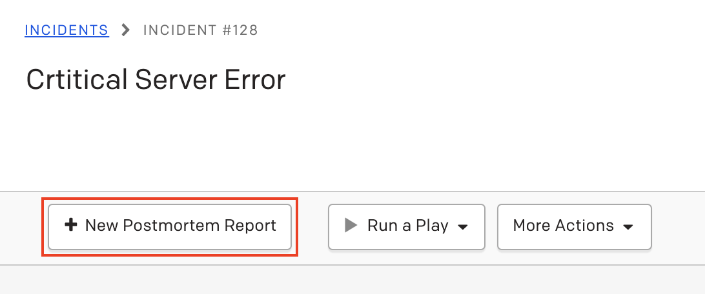
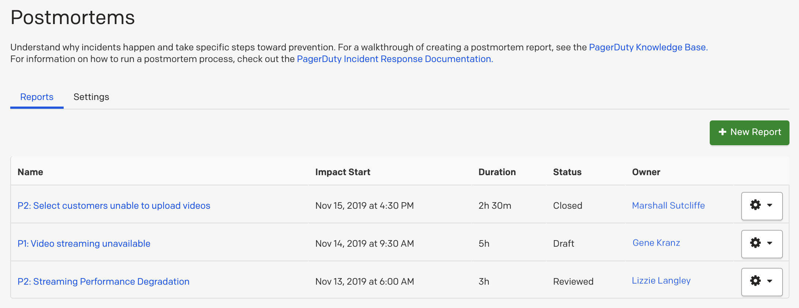
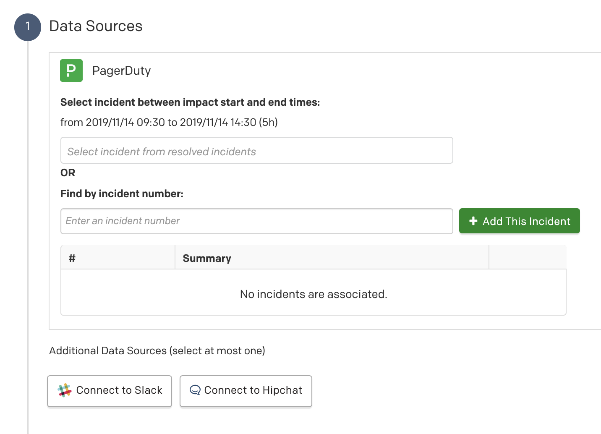
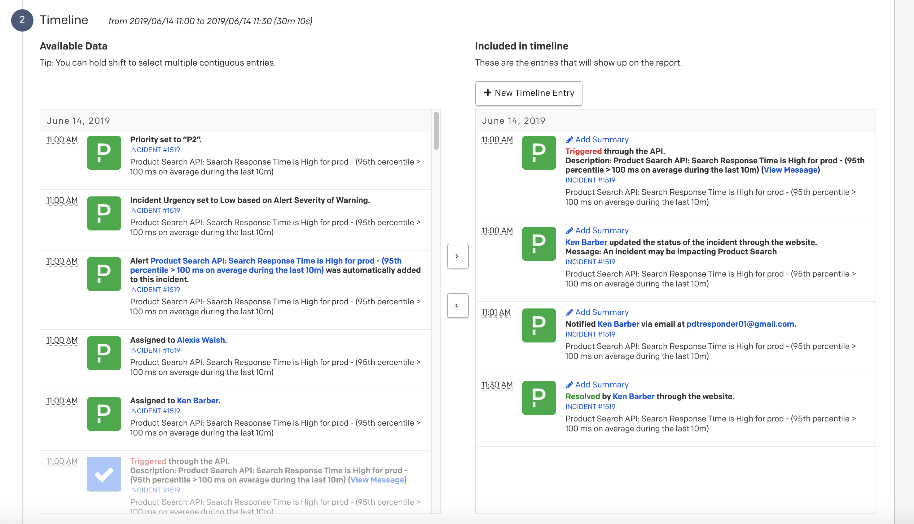
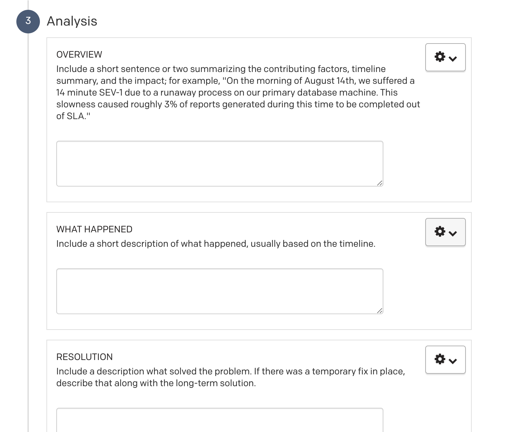
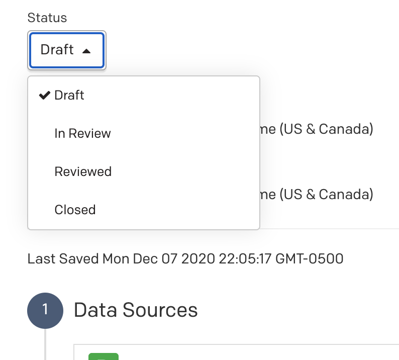
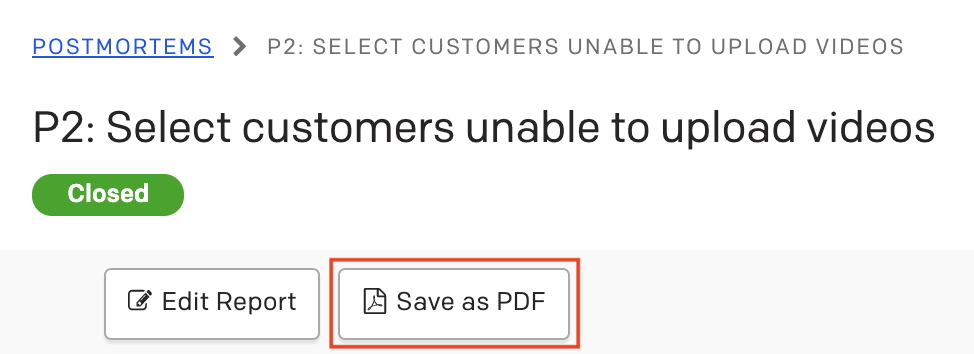
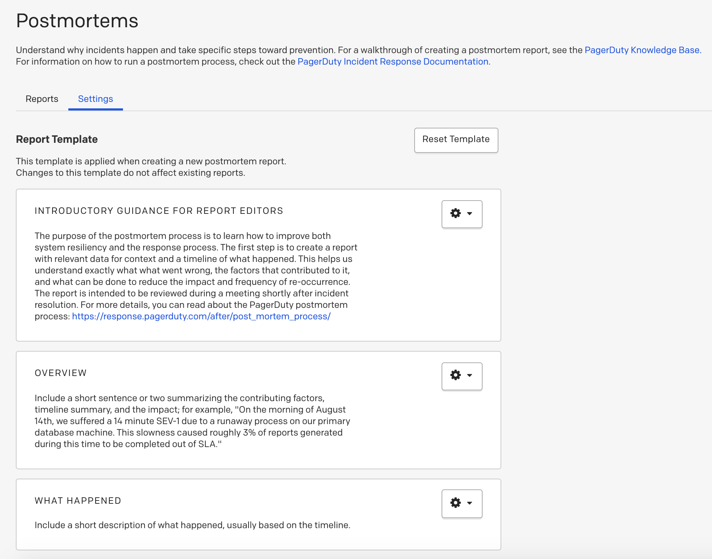
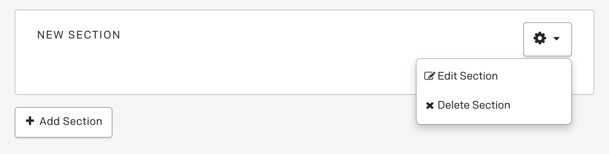

---
cover:
description: ポストモーテムの作成方法を学んだところで、PagerDutyアプリケーションでポストモーテムを作成する方法を見てみましょう。
---

## PagerDutyでレポートを作成する

インシデント管理にPagerDutyを使用している場合は、ポストモーテム機能を活用することを強くお勧めします。これにより、PagerDuty内のインシデントやその他のデータをレポートに関連付けることができ、タイムラインの生成に役立ち、より包括的なレポートを作成することができます。Stakeholder以外のロールの方のみがポストモーテムの作成、変更、および/または削除を行えることに注意してください。（ユーザー権限のマトリックスについては、[サポートページ](https://support.pagerduty.com/main/lang-ja/docs/user-roles)を参照し、ポストモーテム（Postmortem）の項目を確認してください。）
### レポートを作成する

インシデントからポストモーテムを作成するには、（解決済みの）インシデントを選択し、「New Postmortem Report」ボタンをクリックします：

または、カタログからポストモーテムを作成することもできます。「Incidents」→「Postmortems」に移動するか、直接`yoursubdomain.pagerduty.com/postmortems`にアクセスします。そこから「New Report」をクリックします：

カタログからポストモーテムレポートを作成する場合は、レポートを開始した後にインシデントを関連付ける必要があります。推定開始時間や終了時間を含めると、PagerDutyアプリはその時間枠内に発生したインシデントに関連するレポートに対象範囲を制限します。

インシデントからレポートを作成したか、カタログから作成したかに関わらず、複数のインシデントが単一のレポートに適用される状況では、時間枠またはインシデント番号を使用して追加のインシデントを追加できます。

PagerDutyアプリは、アプリ内のイベントに基づいてポストモーテムに表示されるタイムラインを作成します：

Slackやその他のデータソースと統合している場合、その情報も左側の「Available Data（利用可能なデータ）」に表示されます。中央の矢印を使用して、どの項目を追加または削除するかを選択できます。

タイムラインを完了した後、分析を記入する必要があります。このセクションにはいくつかのサブセクションがあります。デフォルトのサブセクションには「Overview（概要）」、「What happened（何が起こったか）」、「Resolution（解決）」などがあります：

レポートに含めたい情報が揃ったら、「Save & View Report」をクリックします。これによりレポートが「Draft（下書き）」状態で保存されます（レポートは「Draft」状態で自動保存されます）。ポストモーテムレポートで利用可能な状態は：Draft（下書き）、In Review（レビュー中）、Reviewed（レビュー済み）、Closed（クローズ）です。ポストモーテムカタログからレポートをクリックし、ページ上部にあるステータスドロップダウンメニューを使用して、ステータスを編集できます：

## 補足
### 外部アクセス
ポストモーテムレポートはどの段階でもPDFにエクスポートできます。これは主に、PagerDutyアプリにいないレビュアーがいる場合や、他の人が最終レポートを閲覧するための会社の一元化されたツールがある場合に使用されます。PDFとして保存するには、ポストモーテムカタログからレポートを選択し、「Save as PDF」ボタンをクリックするだけです：

### カスタマイズ
デフォルトのレポートテンプレートを会社のニーズに合わせて変更することを強くお勧めします。これには、セクションの追加や削除、共通言語に合わせた文言の変更、または各セクションの説明テキストを必要なことを伝えるように変更することが含まれます。

セクションを追加、編集、または削除したい場合は、ポストモーテムカタログの設定で行うことができます：

適切なセクションのギアをクリックしてセクションを編集できます。また、テンプレートの下部にある「Add Section」をクリックして、まったく新しいセクションを追加することもできます：

変更は今後のポストモーテムレポートにのみ適用されます。既に作成されたレポートには適用されません。
質問や説明情報をどのように設定するかのガイダンスについては、このガイドの[分析の質問](https://postmortems.pagerduty.co.jp/resources/analysis/)セクションを参照してください。

いつでもデフォルトのテンプレートから再開したい場合は、テンプレートをリセットできます。元のデフォルトセクションに戻すには、レポートテンプレートの上部にある「Reset Template」ボタンをクリックします。ポップアップメニューでテンプレートをリセットするか、キャンセルするかの選択が促されます。

### レポートと関連インシデント間のナビゲーション
現在、レポートに関連付けられたインシデントを確認する唯一の方法は、レポートを開いて追加されたインシデントを確認することです。現在、インシデントに移動して関連するレポートを表示することはできません。
