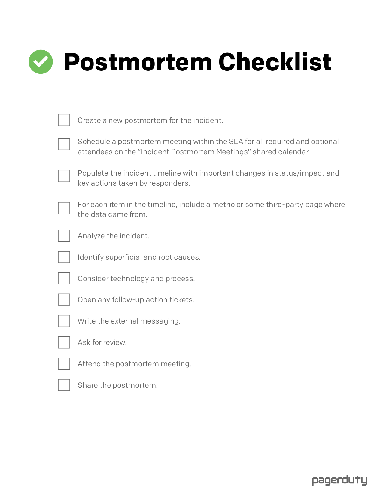

---
cover:
description: ポストモーテム実施にあたってのチェックリストです。
---

ポストモーテムが必要なインシデント（Sev-1またはSev-2インシデント）毎に、ポストモーテム実施の各ステップのサブタスクを持つチケットテンプレートをクローンします。これにより、ポストモーテム作成におけるチームの共同作業を支援し、ポストモーテムミーティングまでの進捗を可視化します。

以下は、ポストモーテムを実行するために必要なステップです。

[PDFとしてダウンロード](../assets/pdf/PostmortemChecklist.pdf).

